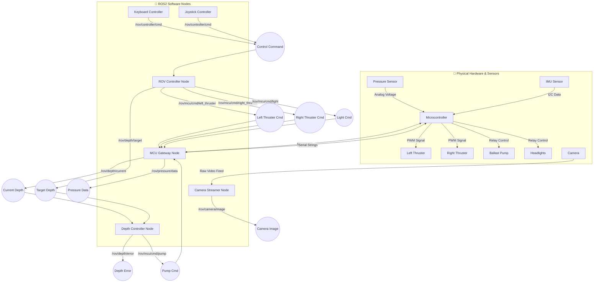

# 🏗️ System Architecture

## 📖 Introduction
To make our ROV smart and reliable, we divided its software into many small, independent programs called **Nodes**. Each node has a specific job, such as reading a sensor or spinning a motor. They communicate with each other using a messaging system provided by **ROS2**. 

This design means that if the camera node crashes, the thruster node keeps working, and the robot does not sink. This document explains how data moves through the system.

---

## 🗺️ System Flowchart

The diagram below shows how the hardware (like motors and sensors) connects to the software (ROS2 Nodes) through topics.

---

## 🔌 Hardware Layer Details
The hardware layer consists of the physical parts inside and outside the robot.
* **Microcontroller (MCU):** This is usually an Arduino or ESP32. It sits inside the robot's dry hull. It reads the raw electrical signals from the sensors and sends PWM (Pulse Width Modulation) signals to control the thrusters.
* **Sensors:** 
  * The **Pressure Sensor** tells us the water pressure, which we use to calculate depth.
  * The **IMU** (Inertial Measurement Unit) tells us the robot's tilt (Pitch, Roll) and heading (Yaw).
  * The **Camera** looks forward and sends live video back to the operator.
* **Actuators:**
  * **Left and Right Thrusters** push the robot forward, backward, and turn it.
  * The **Ballast Pump** takes water in to make the robot sink, or pushes water out to make it float.
  * The **Headlights** help the camera see in the dark.

---

## 🤖 Software Node Details
The software runs on the "Companion Computer" (like a Raspberry Pi or a laptop running Linux) and consists of the following key nodes:

### 1. The MCU Gateway (`mcu_gateway.py`)
Think of this node as the "Translator". ROS2 speaks in modern data packets, but the Microcontroller speaks in raw serial text. 
* **What it does:** It listens to ROS2 command topics (like "turn right thruster on") and translates them into a simple text string over USB to the Microcontroller. It also reads text strings coming from the Microcontroller (like "Pressure is 101 kPa") and translates them into ROS2 data topics.

### 2. The ROV Controller (`rov_controller.py`)
Think of this node as the "Pilot". 
* **What it does:** It takes human commands (from a keyboard, joystick, or mobile app) and figures out exactly what the thrusters need to do. If the human says "Go Forward", the ROV Controller tells *both* the left and right thruster to spin forward. If the human says "Turn Left", it tells the right thruster to spin forward and the left thruster to spin backward.

### 3. The Depth Controller (`depth_controller.py`)
Think of this node as the "Stabilizer".
* **What it does:** The operator sets a "Target Depth" (e.g., stay exactly 2 meters underwater). The Depth Controller constantly compares the "Target Depth" with the "Current Depth". If the robot is too high, it commands the ballast pump to take in water. If the robot is too low, it commands the pump to push water out.

### 4. The Camera Streamer (`camera_streamer.py`)
* **What it does:** It captures the physical video feed from the USB camera (or simulated camera) and converts it into standard ROS2 Image messages. This allows our Web Dashboard or computer vision algorithms to easily read the video frame by frame.

---

By dividing the system this way, we can easily test one part without breaking another. For example, we can test the Depth Controller algorithm entirely in the Gazebo simulator before ever putting the real robot in the water.
